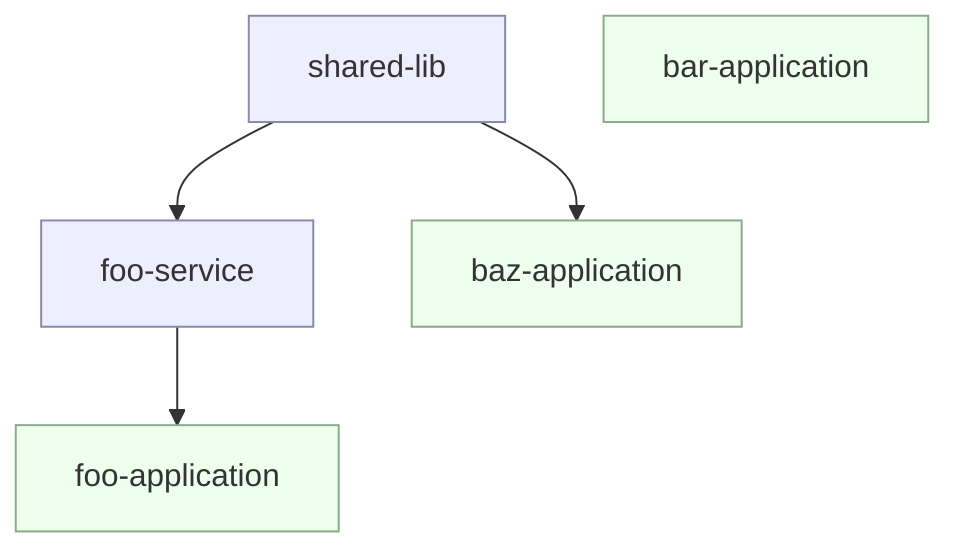

```json
{
  "$schema": "https://raw.githubusercontent.com/googleapis/release-please/main/schemas/config.json",
  "release-type": "maven",
  "separate-pull-requests": false,
  "include-component-in-tag": true,
  "include-v-in-tag": true,
  "plugins": [
    {
      "type": "maven-workspace",
      "considerAllArtifacts": true
    }
  ],
  "packages": {
    "shared-lib": {
      "component": "shared-lib",
      "release-type": "maven"
    },
    "foo-application": {
      "component": "foo-application",
      "release-type": "maven"
    }
  }
}

```