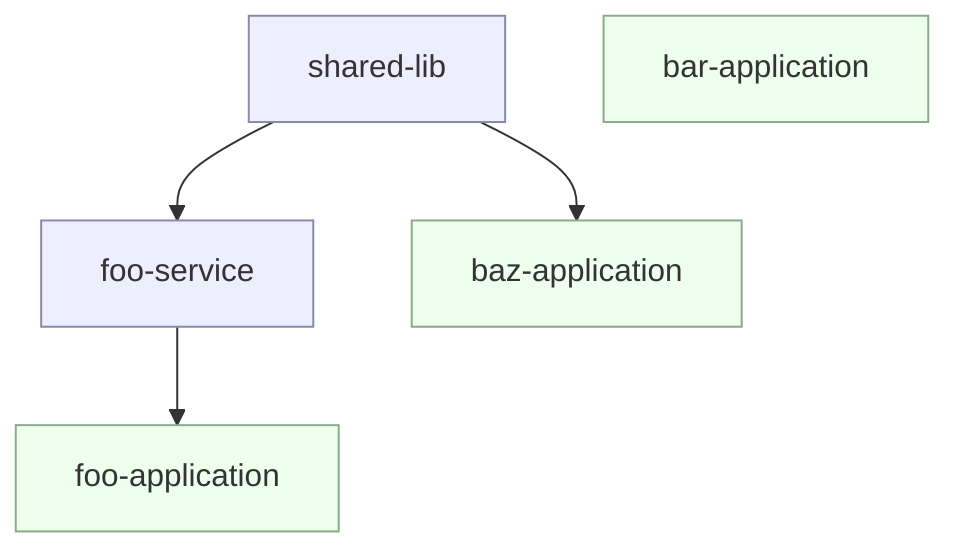

Links:
* https://github.com/googleapis/release-please/issues/2339
* https://github.com/meltsufin/google-cloud-java/tree/main

```mermaid
graph TD
  %% Nodes
  shared["shared-lib"]
  fooservice["foo-service"]
  fooapp["foo-application"]
  barapp["bar-application"]
  bazapp["baz-application"]

  %% Permutation A: lib -> lib -> application
  shared --> fooservice
  fooservice --> fooapp

  %% Permutation B: application with no deps
  %% (bar-application has no incoming edges)

  %% Permutation C: lib -> application
  shared --> bazapp

  %% Styling (optional)
  classDef lib fill:#eef,stroke:#88a,stroke-width:1px;
  classDef app fill:#efe,stroke:#8a8,stroke-width:1px;
  class shared,fooservice lib;
  class fooapp,barapp,bazapp app;

```

